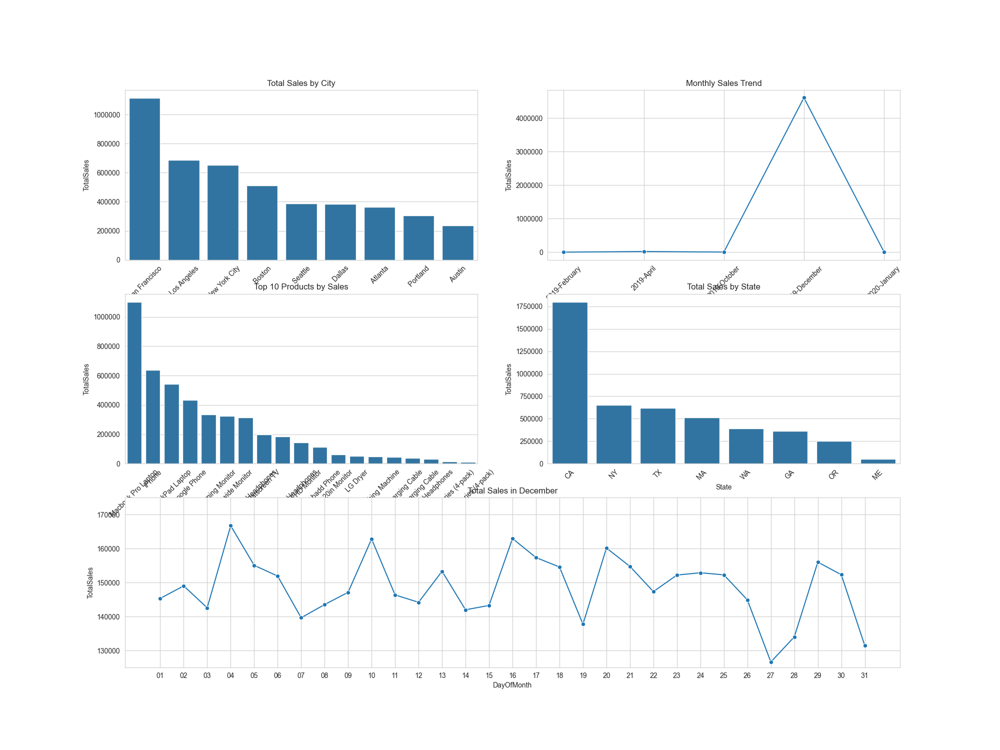
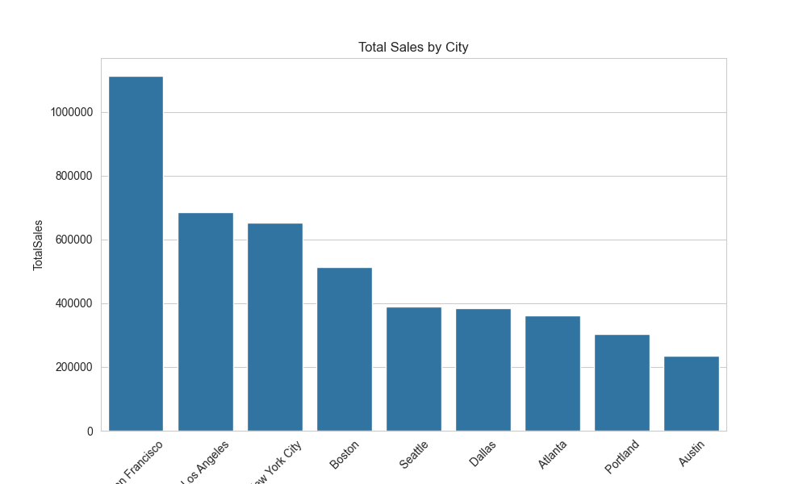
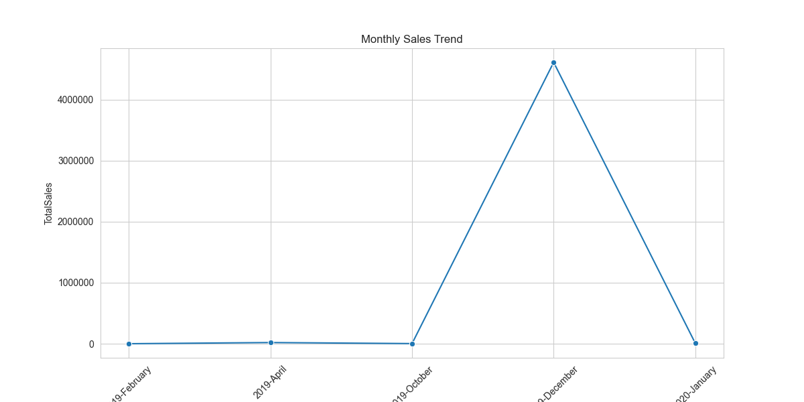
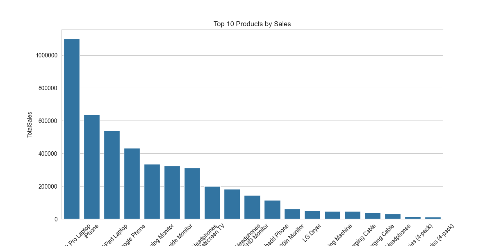
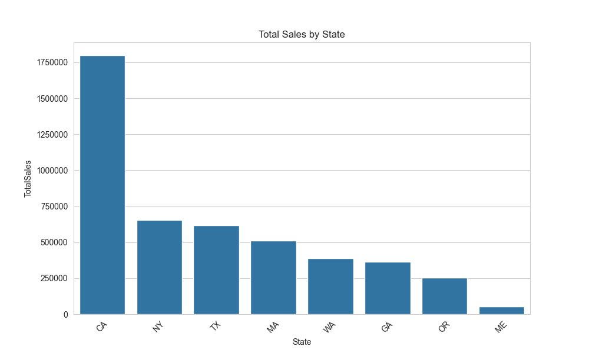
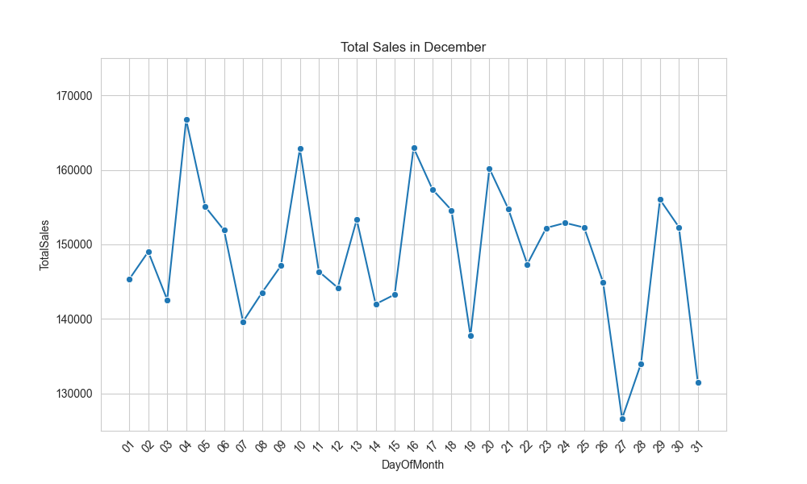
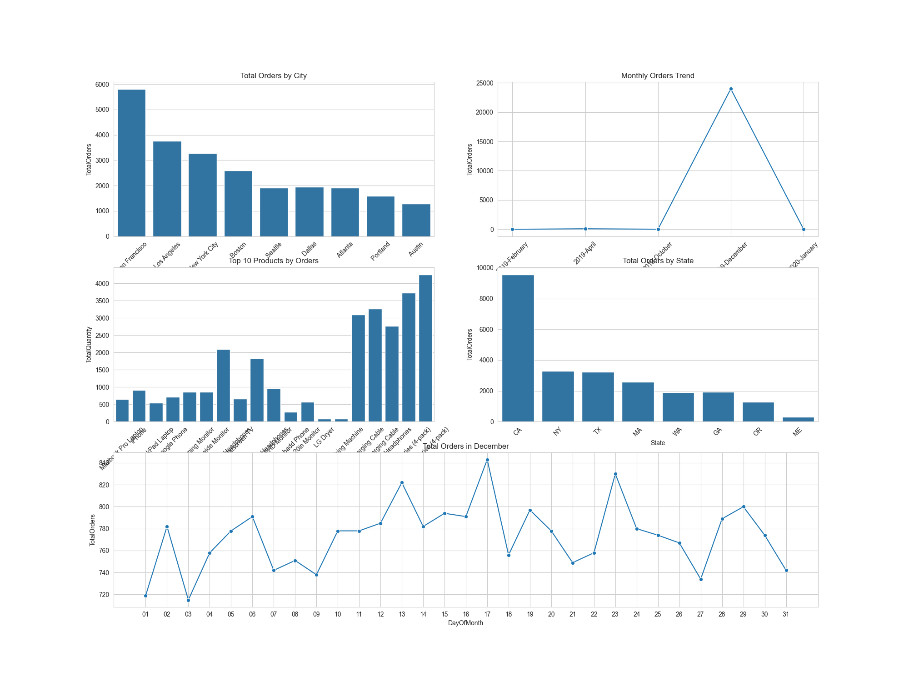
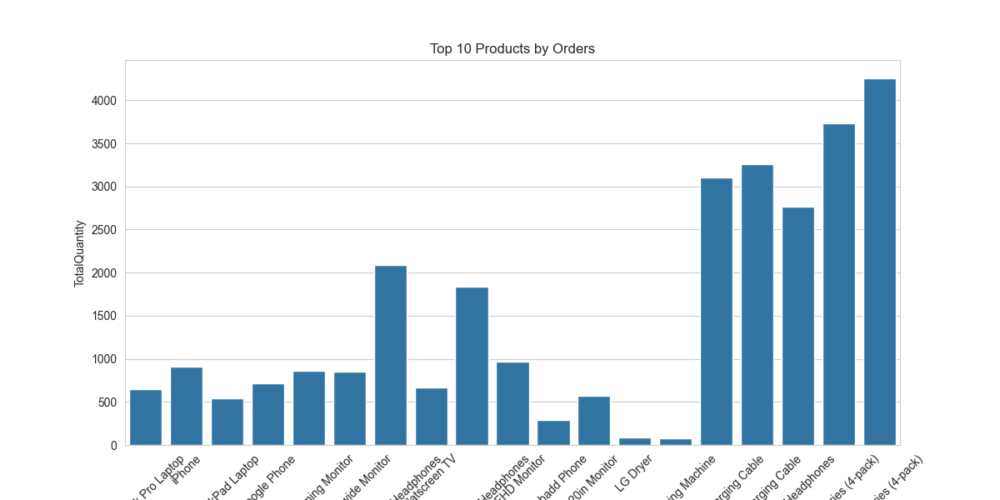
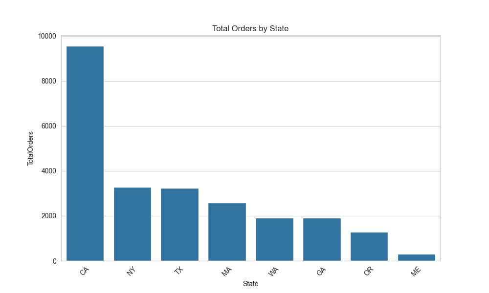
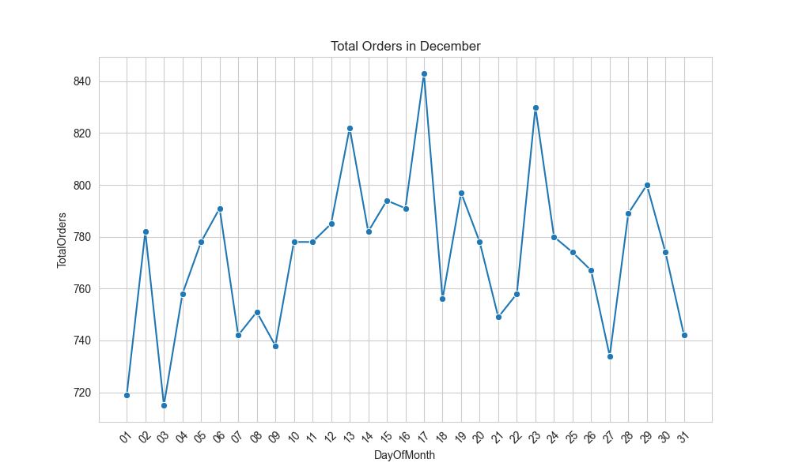

# Database Visualization Dashboard

## Project Overview

This project involves converting raw sales data into a structured database and creating a dashboard for visualizations.
The dashboard provides **insights and trends** in the data through interactive visualizations.

## Objectives

* Convert raw CSV sales data into a normalized database.
* Build relational tables for **Orders, Products, Customers, and Sales**.
* Create **views** for business insights.
* Enable **data visualization dashboards** in Tableau / Power BI / Python.

## Technologies Used

* **Database**: SQLite / PostgreSQL / MySQL
* **Visualization**: Tableau, Power BI, or D3.js
* **Languages**: Python, SQL

---

## 📂 Database Schema & Sample Data

### 🛒 Sales_Data.csv (Raw Data Sample)

| Order ID | Product              | Quantity Ordered | Price Each | Order Date          | Purchase Address                       | Month | Sales  | City          | Hour |
| -------- | -------------------- | ---------------- | ---------- | ------------------- | -------------------------------------- | ----- | ------ | ------------- | ---- |
| 295665   | Macbook Pro Laptop   | 1                | 1700.0     | 2019-12-30 00:01:00 | 136 Church St, New York City, NY 10001 | 12    | 1700.0 | New York City | 0    |
| 295666   | LG Washing Machine   | 1                | 600.0      | 2019-12-29 07:03:00 | 562 2nd St, New York City, NY 10001    | 12    | 600.0  | New York City | 7    |
| 295667   | USB-C Charging Cable | 1                | 11.95      | 2019-12-12 18:21:00 | 277 Main St, New York City, NY 10001   | 12    | 11.95  | New York City | 18   |
| 295668   | 27in FHD Monitor     | 1                | 149.99     | 2019-12-22 15:13:00 | 410 6th St, San Francisco, CA 94016    | 12    | 149.99 | San Francisco | 15   |
| 295669   | USB-C Charging Cable | 1                | 11.95      | 2019-12-18 12:38:00 | 43 Hill St, Atlanta, GA 30301          | 12    | 11.95  | Atlanta       | 12   |

---

### 👤 customers

| CustomerID | PurchaseAddress | City          | State | ZIP   |
| ---------- | --------------- | ------------- | ----- | ----- |
| 1          | 136 Church St   | New York City | NY    | 10001 |
| 2          | 562 2nd St      | New York City | NY    | 10001 |
| 3          | 277 Main St     | New York City | NY    | 10001 |
| 4          | 410 6th St      | San Francisco | CA    | 94016 |
| 5          | 43 Hill St      | Atlanta       | GA    | 30301 |

---

### 🔗 order_customers

| OrderID | CustomerID |
| ------- | ---------- |
| 295665  | 1          |
| 295666  | 2          |
| 295667  | 3          |
| 295668  | 4          |
| 295669  | 5          |

---

### 📦 `order_items`

| ItemID | OrderID | ProductID | QuantityOrdered | Sales  |
| ------ | ------- | --------- | --------------- | ------ |
| 1      | 295665  | 1         | 1               | 1700   |
| 2      | 295666  | 2         | 1               | 600    |
| 3      | 295667  | 3         | 1               | 11.95  |
| 4      | 295668  | 4         | 1               | 149.99 |
| 5      | 295669  | 3         | 1               | 11.95  |

---

### 📋 orders

| OrderID | OrderDate  | Hour | Time     |
| ------- | ---------- | ---- | -------- |
| 141234  | 2019-01-22 | 21   | 21:25:00 |
| 141235  | 2019-01-28 | 14   | 14:15:00 |
| 141236  | 2019-01-17 | 13   | 13:33:00 |
| 141237  | 2019-01-05 | 20   | 20:33:00 |
| 141238  | 2019-01-25 | 11   | 11:59:00 |

---

### 🏷️ products

| ProductID | ProductName           | PriceEach |
| --------- | --------------------- | --------- |
| 1         | Macbook Pro Laptop    | 1700      |
| 2         | LG Washing Machine    | 600       |
| 3         | USB-C Charging Cable  | 11.95     |
| 4         | 27in FHD Monitor      | 149.99    |
| 5         | AA Batteries (4-pack) | 3.84      |

---

## 📊 Views (Business Insights)

### 🔍 order_details

| OrderID | OrderDate  | Time     | PurchaseAddress | City          | State | ZIP   | ProductName          | PriceEach | Quantity | Sales  |
| ------- | ---------- | -------- | --------------- | ------------- | ----- | ----- | -------------------- | --------- | -------- | ------ |
| 295665  | 2019-12-30 | 00:01:00 | 136 Church St   | New York City | NY    | 10001 | Macbook Pro Laptop   | 1700      | 1        | 1700   |
| 295666  | 2019-12-29 | 07:03:00 | 562 2nd St      | New York City | NY    | 10001 | LG Washing Machine   | 600       | 1        | 600    |
| 295667  | 2019-12-12 | 18:21:00 | 277 Main St     | New York City | NY    | 10001 | USB-C Charging Cable | 11.95     | 1        | 11.95  |
| 295668  | 2019-12-22 | 15:13:00 | 410 6th St      | San Francisco | CA    | 94016 | 27in FHD Monitor     | 149.99    | 1        | 149.99 |
| 295669  | 2019-12-18 | 12:38:00 | 43 Hill St      | Atlanta       | GA    | 30301 | USB-C Charging Cable | 11.95     | 1        | 11.95  |

---

### 🌆 analysis_by_city

| City          | TotalSales | TotalOrders |
| ------------- | ---------- | ----------- |
| San Francisco | 8262203.91 | 42898       |
| Los Angeles   | 5452570.80 | 28498       |
| New York City | 4664317.43 | 23848       |
| Boston        | 3661642.01 | 19092       |

---

### 🏛️ analysis_by_month

| Year | Month | TotalSales | TotalOrders |
|------|-------|------------|-------------|
| 2019 | February | 11.99 | 1 |
| 2019 | April | 19073.71 | 88 |
| 2019 | October | 2119.42 | 15 |
| 2019 | December | 4610626.83 | 23975 |
| 2020 | January | 8670.29 | 31 |

---

### ⏰ analysis_of_december

| Day_Of_Month | TotalQuantity | TotalSales |
|--------------|----------------|------------|
| 01           | 719            | 145337.12  |
| 02           | 782            | 149025.71  |
| 03           | 715            | 142570.45  |
| 04           | 758            | 166727.69  |
| 05           | 778            | 155079.3   |
---

### 📦 analysis_of_product

| ProductName            | TotalQuantity | TotalSales |
| ---------------------- | ------------- | ---------- |
| Macbook Pro Laptop     | 4728          | 8037600    |
| iPhone                 | 6849          | 4794300    |
| ThinkPad Laptop        | 4130          | 4129958.7  |
| Google Phone           | 5532          | 3319200    |
| 27in 4K Gaming Monitor | 6244          | 2435097.56 |

---
Perfect 👌 you’ve built **two dashboards + individual plot functions** for **Sales** and **Orders**.
For your README, you’ll want clear **headings** and **links to the saved PNGs** (which you already save in the functions).

Here’s how you can document them in `README.md`:

---

# 📊 Dashboards & Plots

This project generates **visualizations** of sales and orders data from the `sales.db` database.
All plots are automatically saved as `.png` files for easy reference and sharing.

---

## 📈 Sales Visualizations

### 🔹 Sales Dashboard

Combines all major sales plots (city, month, state, product, December).
📷 

---

### 🔹 Sales by City

Shows total sales aggregated by city.
📷 

---

### 🔹 Sales by Month

Shows monthly sales trends across years.
📷 

---

### 🔹 Sales by Product

Top products ranked by sales.
📷 

---

### 🔹 Sales by State

Total sales distribution across states.
📷 

---

### 🔹 Sales in December

Daily sales trend in December.
📷 

---

## 📦 Orders Visualizations

### 🔹 Orders Dashboard

Combines all major order plots (city, month, state, product, December).
📷 

---

### 🔹 Orders by City

Shows total orders aggregated by city.
📷 

---

### 🔹 Orders by Month

Shows monthly order trends across years.
📷 

---

### 🔹 Orders by Product

Top products ranked by total quantity ordered.
📷 

---

### 🔹 Orders by State

Total orders distribution across states.
📷 

---

### 🔹 Orders in December

Daily orders trend in December.
📷 

---

